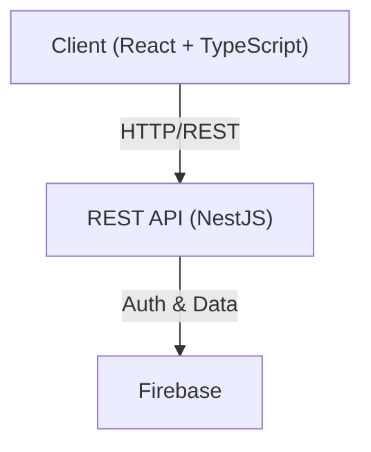

# ⚽ Quiniela App

A full-stack web application for managing and participating in sports prediction pools (quinielas).
This project is focused on clean architecture, separation of concerns, and the use of modern web technologies with TypeScript.

---

## 🧠 Purpose of the Project

The goal of this project is to practice and demonstrate:

-   **Full-stack software development** using TypeScript
-   **REST API design** and implementation
-   **Frontend–backend communication**
-   **Scalable and maintainable** project organization

This is a **personal project** built to strengthen my software engineering skills and prepare for professional environments.

---

## 👤 Role

-   **Full-stack Developer** (personal project)

---

## 🛠 Tech Stack

### Frontend

-   **Framework:** React 19 + Vite
-   **Language:** TypeScript
-   **Styling:** TailwindCSS 4
-   **Icons:** Lucide React
-   **Routing:** React Router DOM 7

### Backend

-   **Framework:** NestJS
-   **Language:** TypeScript
-   **Authentication & Database:** Firebase (Firebase Admin SDK)
-   **HTTP Client:** Axios

---

## 🏗 Architecture Overview



---

## ✨ Key Features

-   **RESTful API** built with NestJS and TypeScript
-   **Frontend** developed with React and strongly typed components
-   **Firebase authentication** and secure data handling
-   **Modular and scalable** project structure
-   **Admin panel** for match, score, and configuration management
-   **Sports prediction (quiniela) system** _(in progress)_

---

## 🧠 What I Built & Learned

-   Designed a full-stack architecture separating frontend and backend responsibilities
-   Built REST APIs following HTTP and REST principles
-   Applied TypeScript to improve code safety and maintainability
-   Integrated Firebase for authentication and data management
-   Structured the project with scalability and maintainability in mind

---

## 📂 Project Structure

-   `/frontend` → React client application
-   `/backend` → NestJS API and server logic

---

## 🚀 Getting Started

Follow these steps to run the project locally.

### Prerequisites

-   Node.js (v18 or higher)
-   npm

### Backend Setup

1.  Navigate to the backend directory:

    ```bash
    cd backend
    ```

2.  Install dependencies:

    ```bash
    npm install
    ```

3.  Environment configuration:
    Add your Firebase service account credentials (e.g. `serviceAccountKey.json`) inside: `src/config/`

4.  Start the development server:

    ```bash
    npm run start:dev
    ```

### Frontend Setup

1.  Navigate to the frontend directory:

    ```bash
    cd frontend
    ```

2.  Install dependencies:

    ```bash
    npm install
    ```

3.  Start the development server:

    ```bash
    npm run dev
    ```

---

## 📜 Available Scripts

### Frontend

| Script          | Description                        |
| :-------------- | :--------------------------------- |
| `npm run dev`   | Starts the Vite development server |
| `npm run build` | Builds the app for production      |
| `npm run lint`  | Runs the linter                    |

### Backend

| Script               | Description                        |
| :------------------- | :--------------------------------- |
| `npm run start:dev`  | Starts NestJS in watch mode        |
| `npm run build`      | Builds the backend application     |
| `npm run start:prod` | Runs the production build          |

---

## 📌 Project Status

**🚧 Active development**
The quiniela prediction system and additional features are currently in progress.

---

## 📬 Contact

-   **GitHub:** [@cristianlona](https://github.com/cristianlona)
-   **Linkedin:** [Cristian Lona](https://www.linkedin.com/in/cristian-josue-lona-avalos-3411b2218/)
-   **Email:** cristianlonavalos@gmail.com
   