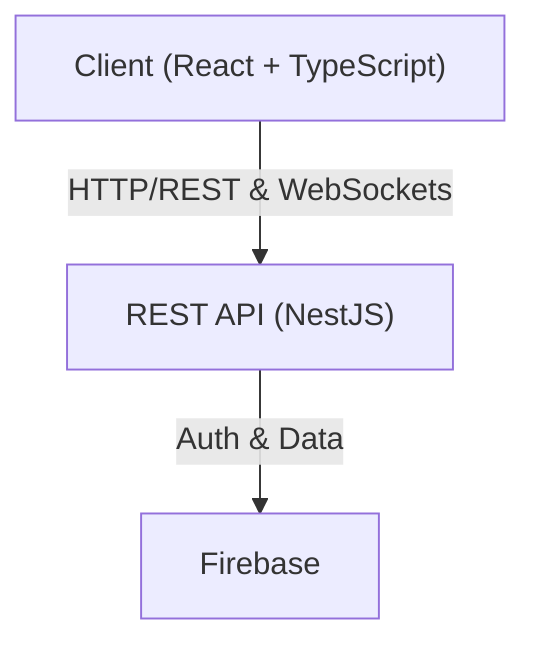

# ⚽ Quiniela App

A full-stack web application for managing and participating in sports prediction pools (quinielas).
This project is focused on clean architecture, separation of concerns, and the use of modern web technologies with TypeScript.

---

## 🧠 Purpose of the Project

The goal of this project is to practice and demonstrate:

-   **Full-stack software development** using TypeScript
-   **REST API design** and implementation
-   **Frontend–backend communication**
-   **Scalable and maintainable** project organization
-   **Modern UI/UX** implementation

This is a **personal project** built to strengthen my software engineering skills and prepare for professional environments.

---

## 👤 Role

-   **Full-stack Developer** (personal project)

---

## 🛠 Tech Stack

### Frontend

-   **Framework:** React 19 + Vite
-   **Language:** TypeScript
-   **Styling:** TailwindCSS 4
-   **UI Components:** Custom Modals, Lucide React Icons
-   **Notifications:** Sonner (Toasts)
-   **Routing:** React Router DOM 7
-   **Real-time:** Socket.io-client

### Backend

-   **Framework:** NestJS
-   **Language:** TypeScript
-   **Authentication & Database:** Firebase (Firebase Admin SDK)
-   **Real-time:** Socket.io (WebSockets)
-   **Web Scraping:** Cheerio
-   **HTTP Client:** Axios

---

## 🏗 Architecture Overview


```mermaid
graph TD
    Client["Client (React + TypeScript)"] -->|HTTP/REST & WebSockets| API["REST API (NestJS)"]
    API -->|Auth & Data| Firebase[Firebase]
```

---

## ✨ Key Features

-   **RESTful API** built with NestJS and TypeScript
-   **Real-time Updates** via WebSockets for instant data rendering across clients
-   **Frontend** developed with React and strongly typed components
-   **Modern UI Experience**:
    -   Elegant **Toast Notifications** (Sonner) for feedback
    -   Responsive **Glassmorphism Modals** for confirmations
    -   Fully responsive design (Mobile First)
-   **Firebase authentication** and secure data handling
-   **Modular and scalable** project structure
-   **Automated Match Scraping** from official Liga MX sources
-   **Admin panel** for comprehensive management:
    -   **Match & Score Management**: Real-time updates with status toggling.
    -   **History Tab**: View past weeks and participant records.
    -   **Manual Entry**: Register offline participants directly.
    -   **Secure JWT Authentication** for administrative access.
-   **Sports prediction (quiniela) system**:
    -   User-friendly filling flow
    -   Live countdowns and validation
    -   Interactive Scoreboard with auto-scaling tables

---

## 🧠 What I Built & Learned

-   Designed a full-stack architecture separating frontend and backend responsibilities
-   Built REST APIs following HTTP and REST principles alongside WebSocket Gateways
-   Applied TypeScript to improve code safety and maintainability
-   Integrated Firebase for authentication and NoSQL data management
-   Implemented a modern, polished UI using Tailwind CSS and React ecosystem best practices
-   Structured the project with scalability and maintainability in mind
-   **Deployed to Google Cloud Platform** via Firebase Hosting and Cloud Functions (2nd Gen).

---

## 📂 Project Structure

-   `/frontend` → React client application
-   `/backend` → NestJS API and server logic

---

## 🚀 Getting Started

Follow these steps to run the project locally.

### Prerequisites

-   Node.js (v22 recommended)
-   npm
-   Firebase CLI (`npm install -g firebase-tools`)

### Backend Setup

1.  Navigate to the backend directory:

    ```bash
    cd backend
    ```

2.  Install dependencies:

    ```bash
    npm install
    ```

3.  Environment configuration:
    - Add your Firebase service account credentials (`serviceAccountKey.json`) inside the backend root or set up Google Application Default Credentials.
    - Create a `.env` file in the `backend` directory with:
      ```env
      VITE_ADMIN_PASSWORD=your_secure_password
      ```

4.  Start the development server:

    ```bash
    npm run start:dev
    ```

    The backend will normally run on `http://localhost:3000`.

### Frontend Setup

1.  Navigate to the frontend directory:

    ```bash
    cd frontend
    ```

2.  Install dependencies:

    ```bash
    npm install
    ```

3.  Environment configuration:
    - Create a `.env` file in the `frontend` directory with:
      ```env
      VITE_API_URL=http://localhost:3000/api
      VITE_ADMIN_PASSWORD=your_secure_password
      ```

4.  Start the development server:

    ```bash
    npm run dev
    ```

    The frontend will run on `http://localhost:5173`.

### ☁️ Deployment (Firebase)

The application is configured to be deployed on Firebase.

- **Frontend:** Deployed to Firebase Hosting.
- **Backend:** Deployed to Firebase Cloud Functions (2nd Gen, Node.js 22).

To deploy everything:

```bash
firebase deploy --project your-project-id
```

If you only want to deploy a specific part:

```bash
firebase deploy --only hosting
firebase deploy --only functions
```

---

## 📜 Available Scripts

### Frontend

| Script          | Description                        |
| :-------------- | :--------------------------------- |
| `npm run dev`   | Starts the Vite development server |
| `npm run build` | Builds the app for production      |
| `npm run lint`  | Runs the linter                    |

### Backend

| `npm run start:dev`  | Starts NestJS in watch mode        |
| `npm run build`      | Builds the backend application     |
| `npm run start:prod` | Runs the production build          |

---

## 📌 Project Status

**🚧 Active development**
The core Quiniela flow (filling, submission, scoreboard, admin publishing) is complete and modernized. Additional features and refinements are ongoing.

---

## 📬 Contact

-   **GitHub:** [@cristianlona](https://github.com/cristianlona)
-   **Linkedin:** [Cristian Lona](https://www.linkedin.com/in/cristian-josue-lona-avalos-3411b2218/)
-   **Email:** Cristian.lonadev@gmail.com
