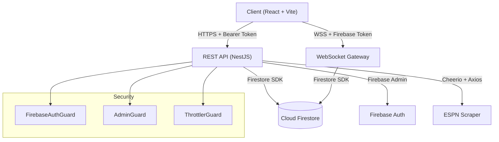

# ⚽ Quiniela App

A full-stack web application for managing and participating in sports prediction pools (quinielas).
Built with clean architecture, layered security, and modern web technologies — fully deployed on Google Cloud Platform via Firebase.

---

## 🧠 Purpose of the Project

The goal of this project is to practice and demonstrate:

-   **Full-stack software development** using TypeScript
-   **REST API design** with authentication and authorization layers
-   **Production-grade security**: bcrypt hashing, JWT, Firebase Auth, CORS policies, rate limiting
-   **Performance optimization**: in-memory caching, query optimization, pagination
-   **Modern UI/UX** with real-time WebSocket updates
-   **Cloud deployment** on Firebase Hosting + Cloud Functions (2nd Gen)

This is a **personal project** built to strengthen my software engineering skills and prepare for professional environments.

---

## 👤 Role

-   **Full-stack Developer** (personal project)

---

## 🛠 Tech Stack

### Frontend

-   **Framework:** React 19 + Vite
-   **Language:** TypeScript
-   **Styling:** TailwindCSS 4
-   **UI Components:** Custom Modals, Lucide React Icons
-   **Notifications:** Sonner (Toasts)
-   **Routing:** React Router DOM 7
-   **Real-time:** Socket.io-client
-   **Auth:** Firebase Authentication (Google Sign-In via popup)

### Backend

-   **Framework:** NestJS
-   **Language:** TypeScript
-   **Authentication:** Firebase Admin SDK + JWT + bcrypt
-   **Database:** Cloud Firestore (NoSQL)
-   **Real-time:** Socket.io (WebSockets) with token-authenticated handshake
-   **Web Scraping:** Cheerio + Axios (with in-memory cache)
-   **Security:** @nestjs/throttler (rate limiting), CORS whitelisting
-   **Deployment:** Firebase Cloud Functions (2nd Gen, Node.js 22)

---

## 🏗 Architecture Overview


```mermaid
graph TD
    Client["Client (React + Vite)"] -->|HTTPS + Bearer Token| API["REST API (NestJS)"]
    Client -->|WSS + Firebase Token| WS["WebSocket Gateway"]
    API -->|Firestore SDK| DB[(Cloud Firestore)]
    API -->|Firebase Admin| Auth[Firebase Auth]
    WS -->|Firestore SDK| DB
    API -->|Cheerio + Axios| ESPN[ESPN Scraper]
    
    subgraph Security
        Guard1[FirebaseAuthGuard]
        Guard2[AdminGuard]
        Guard3[ThrottlerGuard]
    end
    
    API --> Guard1
    API --> Guard2
    API --> Guard3
```

---

## 🔒 Security Architecture

The application implements **defense in depth** with multiple security layers:

| Layer | Component | Protection |
|-------|-----------|------------|
| **Secrets** | `backend/.env` | JWT_SECRET, ADMIN_PASSWORD_HASH — never exposed to frontend |
| **Password Hashing** | bcrypt (12 rounds) | Admin password stored as hash, not plaintext |
| **Authentication** | Firebase Auth + JWT | Google Sign-In for users, JWT for admin sessions |
| **Authorization** | `FirebaseAuthGuard` / `AdminGuard` | Route-level access control on all write endpoints |
| **WebSocket Auth** | Token handshake | Firebase ID token verified on connection, rejected if invalid |
| **CORS** | Whitelist | Only specific Firebase domains + localhost (dev) allowed |
| **Rate Limiting** | `@nestjs/throttler` | 60 req/min global, 5 login attempts per 5 minutes |
| **Data Filtering** | Controller-level | Sensitive fields (`userEmail`) stripped from API responses |
| **Input Validation** | Service-level | Name length limits, field sanitization on updates |

> **Note:** `VITE_ADMIN_EMAIL` in the frontend `.env` is intentionally public — it only controls UI visibility of the admin button. Actual admin authorization is enforced server-side by the `AdminGuard`.

---

## ⚡ Performance Optimizations

| Feature | Implementation | Impact |
|---------|---------------|--------|
| **Scraper Cache** | In-memory, 10 min TTL per league | Avoids hitting ESPN on every request |
| **Weeks Cache** | In-memory, 5 min TTL with auto-invalidation | Reduces Firestore reads by ~90% |
| **Optimized Queries** | Normalized name field + Firestore query | Duplicate check from O(n) → O(1) |
| **Graceful Degradation** | Stale cache fallback on scraper errors | App stays functional even if ESPN is down |
| **Pagination** | Optional `?limit=X&offset=Y` on weeks | Supports future scaling |

---

## ✨ Key Features

-   **RESTful API** built with NestJS and TypeScript
-   **Real-time Updates** via authenticated WebSockets for instant scoreboard rendering
-   **Premium Dark UI Experience**:
    -   Glassmorphism aesthetics with smooth Tailwind animations
    -   Toast notifications (Sonner) for user feedback
    -   Fully responsive design (Mobile First)
-   **Firebase Authentication** (Google Sign-In) for user tracking
-   **Automated Match Scraping** from ESPN (Liga MX, Champions League, Premier League)
-   **Admin panel** for comprehensive management:
    -   Match & Score Management with real-time updates
    -   History Tab for past weeks and participants
    -   Manual Entry for offline participants
    -   Secure JWT authentication with bcrypt-hashed passwords
-   **Sports prediction (quiniela) system**:
    -   User-friendly filling flow with Firebase Auth ID tracking
    -   Live countdowns and deadline validation
    -   Interactive Scoreboard with auto-scaling tables

---

## 📂 Project Structure

```
quiniela-app/
├── frontend/               # React client (Vite)
│   ├── src/
│   │   ├── context/        # Auth context (Firebase)
│   │   ├── features/       # Pages: Home, Fill, Scoreboard, Admin
│   │   ├── lib/            # API client, Firebase config
│   │   └── components/     # Shared UI components
│   └── .env                # Firebase config + VITE_ADMIN_EMAIL
│
├── backend/                # NestJS API
│   ├── src/
│   │   ├── modules/
│   │   │   ├── auth/       # Guards, JWT, bcrypt
│   │   │   ├── weeks/      # Week CRUD + cache
│   │   │   └── picks/      # Participant submissions
│   │   ├── scraper/        # ESPN match scraper + cache
│   │   ├── standings/      # League standings
│   │   ├── events/         # WebSocket gateway
│   │   └── common/         # Firebase service, types, utils
│   └── .env                # JWT_SECRET, ADMIN_PASSWORD_HASH (secret)
│
├── firebase.json           # Hosting + Functions config
└── .gitignore              # Protects .env files
```

---

## 🚀 Getting Started

### Prerequisites

-   Node.js (v22 recommended)
-   npm
-   Firebase CLI (`npm install -g firebase-tools`)

### Backend Setup

1.  Navigate to the backend directory:

    ```bash
    cd backend
    ```

2.  Install dependencies:

    ```bash
    npm install
    ```

3.  Environment configuration — create `backend/.env`:

    ```env
    # Generate with: node -e "console.log(require('crypto').randomBytes(64).toString('hex'))"
    JWT_SECRET=your_secure_random_string
    
    # Admin password (use ADMIN_PASSWORD_HASH in production)
    ADMIN_PASSWORD=your_admin_password
    
    # Or use the bcrypt hash directly (preferred):
    # ADMIN_PASSWORD_HASH=$2b$12$...
    
    ADMIN_EMAIL=your_admin_email@gmail.com
    ```

    > On first start with `ADMIN_PASSWORD`, the server logs the bcrypt hash. Copy it to `ADMIN_PASSWORD_HASH` and remove the plaintext password.

4.  Firebase credentials:
    - Add `serviceAccountKey.json` in the backend root, **or**
    - Set up Google Application Default Credentials

5.  Start the development server:

    ```bash
    npm run start:dev
    ```

    The backend runs on `http://localhost:3000`.

### Frontend Setup

1.  Navigate to the frontend directory:

    ```bash
    cd frontend
    ```

2.  Install dependencies:

    ```bash
    npm install
    ```

3.  Environment configuration — create `frontend/.env`:

    ```env
    VITE_FIREBASE_API_KEY=your_api_key
    VITE_FIREBASE_AUTH_DOMAIN=your_project.firebaseapp.com
    VITE_FIREBASE_PROJECT_ID=your_project_id
    VITE_FIREBASE_STORAGE_BUCKET=your_project.firebasestorage.app
    VITE_FIREBASE_MESSAGING_SENDER_ID=your_sender_id
    VITE_FIREBASE_APP_ID=your_app_id
    VITE_FIREBASE_MEASUREMENT_ID=your_measurement_id
    VITE_ADMIN_EMAIL=your_admin_email@gmail.com
    ```

4.  Start the development server:

    ```bash
    npm run dev
    ```

    The frontend runs on `http://localhost:5173`.

### Firestore Indexes

The following composite indexes are required:

| Collection | Fields | Purpose |
|------------|--------|---------|
| `picks` | `weekId` ↑ + `participantNameNormalized` ↑ | Duplicate name detection |

> Firestore will auto-prompt with a creation link when a missing index is first hit.

---

### ☁️ Deployment (Firebase)

The application is deployed on Firebase.

- **Frontend:** Firebase Hosting
- **Backend:** Firebase Cloud Functions (2nd Gen, Node.js 22)

```bash
# Build frontend first
cd frontend && npm run build && cd ..

# Deploy everything
firebase deploy --project your-project-id

# Deploy only specific parts
firebase deploy --only hosting --project your-project-id
firebase deploy --only functions --project your-project-id
```

> **Important:** Set environment variables for Cloud Functions:
> ```bash
> firebase functions:secrets:set JWT_SECRET
> firebase functions:secrets:set ADMIN_PASSWORD_HASH
> ```

---

## 📜 Available Scripts

### Frontend

| Script          | Description                        |
| :-------------- | :--------------------------------- |
| `npm run dev`   | Starts the Vite development server |
| `npm run build` | Builds the app for production      |
| `npm run lint`  | Runs the linter                    |

### Backend

| Script               | Description                        |
| :------------------- | :--------------------------------- |
| `npm run start:dev`  | Starts NestJS in watch mode        |
| `npm run build`      | Builds the backend application     |
| `npm run start:prod` | Runs the production build          |

---

## 📌 Project Status

**✅ Production-ready** — The core Quiniela flow (filling, submission, scoreboard, admin publishing) is complete with security hardening and performance optimizations deployed.

---

## 📬 Contact

-   **GitHub:** [@cristianlona](https://github.com/cristianlona)
-   **LinkedIn:** [Cristian Lona](https://www.linkedin.com/in/cristian-josue-lona-avalos-3411b2218/)
-   **Email:** Cristian.lonadev@gmail.com
